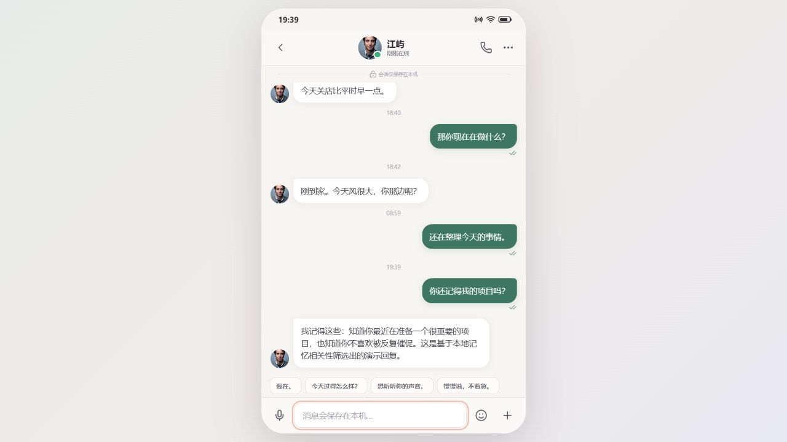
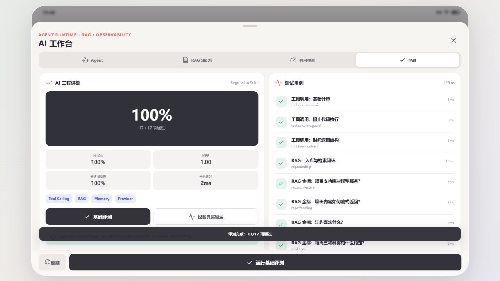

# 染酌 小手机

面向 AI Roleplay 与情感陪伴场景的 Local First 移动端应用，也是面向 AI 应用工程师岗位的完整作品集项目。

## 效果展示

无需 API Key 的本地演示模式：



包含 Tool Calling、RAG Hit@3、MRR 和关键词覆盖的工程评测：



## 核心能力

- 手机式多页面交互：消息、角色、发现、我的
- 单聊、群聊、语音、图片、角色资料与长期记忆
- DeepSeek、OpenAI、Ollama 和兼容接口统一适配
- 本地 AI Gateway，解决浏览器 CORS 与密钥边界问题
- SSE 流式角色回复
- Tool-calling Agent，包含工具执行循环与 Trace
- 本地 RAG：文档切块、BM25 + 向量混合检索、重排序、来源引用和角色知识隔离
- 调用观测：成功率、延迟、Token/字符量与最近 300 条日志
- 模型可靠性：自动重试、模型连通性测试和停止流式生成
- Provider 熔断器、备用模型自动降级和请求 Trace
- 长期记忆：模型提取候选、人工确认、去重和按问题相关性动态检索
- 桌面端 AI 工作台：Agent、知识库、调用观测和工程评测
- SQLite 持久化 RAG、知识块与调用日志
- 无 Key 可用的本地演示模式
- Zod 工具参数校验、Agent 超时和工具调用上限
- PDF、DOCX、TXT、Markdown、CSV、JSON 文件知识库导入
- Capacitor Android 工程与响应式 Web 应用

架构与简历描述见 [docs/PORTFOLIO.md](docs/PORTFOLIO.md)，实测结果见 [docs/ROUND-1-RESULTS.md](docs/ROUND-1-RESULTS.md) 和 [docs/ROUND-2-RESULTS.md](docs/ROUND-2-RESULTS.md)。

## 本地运行

安装依赖：

```powershell
npm install
```

同时启动 Web 应用和本地 AI Gateway：

```powershell
npm run dev:full
```

也可以分别启动：

```powershell
npm run gateway
npm run dev
```

Web 默认地址为 `http://localhost:5173`，Gateway 默认地址为 `http://127.0.0.1:8787`。

## 配置 DeepSeek

推荐使用本地 Gateway 模式：

- Gateway 地址：`http://127.0.0.1:8787`
- 供应商：DeepSeek
- 模型：`deepseek-flash`，需要更强推理时可改用 `deepseek-v4-pro`
- API 密钥：你的 DeepSeek Key

也可以先设置环境变量，再由 Gateway 读取：

```powershell
$env:DEEPSEEK_API_KEY="sk-..."
npm run dev:full
```

使用本地 Gateway 模式保存模型配置后，供应商、模型名、地址和 API 密钥会写入本机 Gateway 数据目录。关闭或重启应用时无需重新填写；Gateway 接口只返回“密钥已配置”状态，不会把原始密钥返回给浏览器。

## 测试与构建

```powershell
npm run test:gateway
npm run test:memory
npm run eval:ai
npm run build
```

运行包含真实模型的评测：

```powershell
$env:DEEPSEEK_API_KEY="sk-..."
npm run eval:ai -- --live
```

## Android

```powershell
npm run cap:sync
npm run cap:open
```

首次生成 Android 工程需要 Android Studio、Android SDK 和 Java 环境。

直接构建调试 APK：

```powershell
npm run cap:apk
```

APK 输出位置：

```text
android\app\build\outputs\apk\debug\app-debug.apk
```

## 手机上使用

最快的方式是用手机浏览器打开线上地址：

```text
https://ranzhuo-mobile.onrender.com/
```

进入 `我的 -> 模型与接口`，选择 `本地 AI Gateway`、`DeepSeek` 和 `deepseek-flash`，填写自己的 API Key，保存后即可聊天。

Android APK 默认连接线上 Render 服务，也可以在设置页中改成其他 Gateway 地址。手机上的 `127.0.0.1` 指向手机自身，不能用来访问电脑上的本地 Gateway。

## GitHub 与线上部署

项目包含：

- `.github/workflows/ci.yml`：推送代码后自动运行 AI 工程测试和构建
- `Dockerfile`：构建单服务镜像，Node 同时提供前端和 AI Gateway
- `render.yaml`：Render 一键部署配置
- `.env.example`：部署所需环境变量模板

### 部署到 Render

1. 把仓库推送到 GitHub。
2. 在 Render 中选择 `New Web Service`。
3. 连接 GitHub 仓库，Render 会读取 `render.yaml`。
4. 在环境变量中添加 `DEEPSEEK_API_KEY`。
5. 根据需要设置 `RANZHUO_RATE_LIMIT_PER_10_MIN`，默认每个 IP 十分钟 30 次模型请求。
6. 部署完成后使用 Render 提供的 HTTPS 地址访问。

公开简历 Demo 推荐设置 `RANZHUO_REQUIRE_CLIENT_KEY=true`。生产环境未配置服务端模型 Key 时，系统会自动启用该模式：每位访问者必须填写自己的 DeepSeek Key，Key 只保存在访问者浏览器中。

RAG 默认使用无需额外费用的本地字符 n-gram 向量，并叠加 BM25 与重排序。生产环境可以配置兼容 OpenAI Embeddings 接口的 `RANZHUO_EMBEDDING_*` 环境变量，升级为真实语义向量。

生产环境设置 `DEEPSEEK_API_KEY` 后，Gateway 会自动启用 DeepSeek，无需在浏览器重复填写密钥。

如果前端和 Gateway 分开部署，需要：

- 构建前端时设置 `VITE_GATEWAY_URL`
- 在 Gateway 设置 `RANZHUO_ALLOWED_ORIGINS` 为前端域名

公开多用户部署时，应增加账号鉴权和调用配额，不能把所有人的请求都计入同一个 API Key。

## 隐私边界

应用不提供模型服务，也不内置云端内容生成。聊天和角色数据以本机存储为主；本地 Gateway 只监听 `127.0.0.1`，调用日志不会保存提示词正文和 API 密钥。
